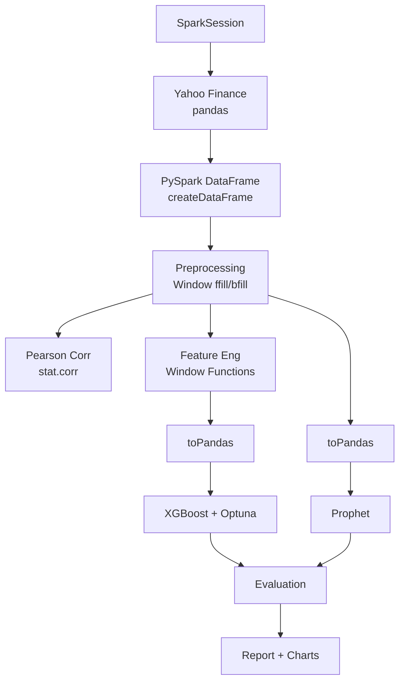

# 🚀 Dự án Antigravity (PySpark Edition)
## Phân tích Liên thị trường & Dự báo Giá Vàng

> **Phiên bản PySpark** — Sử dụng Apache Spark cho xử lý dữ liệu.

---

## ⚡ Công nghệ PySpark được sử dụng

| Module | PySpark Usage |
|--------|---------------|
| **Data Collection** | `SparkSession`, `createDataFrame`, Window functions (forward/backward fill), `describe()` |
| **Correlation** | `spark_df.stat.corr()` cho Pearson correlation |
| **XGBoost Features** | Window functions cho lags, rolling MA/STD/MIN/MAX, `F.lag()`, `F.dayofweek()` |
| **Data Storage** | Spark Schema export, DataFrame API |

---

## 📁 Cấu trúc dự án

```
antigravity_spark/
├── main.py                  # Pipeline chính (PySpark + 2 giai đoạn)
├── spark_session.py         # SparkSession management + HADOOP_HOME
├── data_collection.py       # Thu thập & xử lý dữ liệu (PySpark)
├── correlation_analysis.py  # Tương quan (PySpark stat.corr)
├── model_xgboost.py         # XGBoost (PySpark feature engineering)
├── model_prophet.py         # Prophet + Regressors
├── evaluation.py            # Đánh giá & so sánh
├── visualizations.py        # Biểu đồ
├── period_comparison.py     # So sánh liên giai đoạn
├── requirements.txt         # + pyspark>=3.5.0
├── data/
│   ├── merged_data.csv
│   ├── prophet_data.csv
│   └── spark_schema.txt     # Spark DataFrame schema
└── output/
    ├── report.txt
    └── figures/              # ~24 biểu đồ
```

---

## ⚙️ Cài đặt & Chạy

### Yêu cầu

- **Python 3.10+**
- **Java 17** (required by PySpark)
- **Hadoop winutils** (Windows only)

### Cài đặt

```bash
# 1. Cài Java (Windows)
winget install Microsoft.OpenJDK.17

# 2. Cài thư viện Python
pip install -r requirements.txt

# 3. Chạy pipeline
# Windows PowerShell:
$env:JAVA_HOME='C:\Program Files\Microsoft\jdk-17.0.18.8-hotspot'
$env:PATH="$env:JAVA_HOME\bin;$env:PATH"
$env:PYTHONIOENCODING='utf-8'
python main.py
```

---

## 📊 Kết quả so sánh 2 giai đoạn

### Tương quan Pearson (PySpark `stat.corr`)

| Cặp | 2014-2019 | 2020-2025 | Thay đổi |
|-----|-----------|-----------|----------|
| Gold ↔ WTI | +0.198 | −0.073 | ↓ |
| Gold ↔ DXY | −0.112 | +0.101 | ↑ đảo chiều |
| **WTI ↔ DXY** | **−0.852** | **+0.465** | **↑ đảo chiều hoàn toàn** |

### Hiệu suất mô hình

| Mô hình | Giai đoạn | MAE | RMSE | MAPE |
|---------|-----------|-----|------|------|
| XGBoost | 2014-2019 | 53.02 | 81.70 | 3.58% |
| Prophet | 2014-2019 | 150.23 | 168.09 | 12.10% |
| XGBoost | 2020-2025 | 629.45 | 810.03 | 17.07% |
| Prophet | 2020-2025 | 698.10 | 809.02 | 37.94% |

### PySpark Feature Engineering (Window Functions)

Features được tạo hoàn toàn bằng PySpark:
- **Lag features:** `F.lag("Gold", n).over(Window.orderBy("date"))`
- **Rolling stats:** `F.avg/stddev/min/max("Gold").over(Window.rowsBetween(-(w-1), 0))`
- **Returns:** Computed via `F.col()` / `F.lag()`
- **Date features:** `F.dayofweek()`, `F.month()`, `F.quarter()`

---

## 🛠️ Tech Stack

| Thư viện | Mục đích |
|----------|----------|
| `pyspark` | **Data processing, feature engineering, correlation** |
| `yfinance` | Thu thập dữ liệu |
| `pandas`, `numpy` | Model training interface |
| `xgboost` + `optuna` | ML model + optimization |
| `prophet` | Chuỗi thời gian |
| `matplotlib`, `seaborn` | Visualizations |
| `statsmodels` | Granger Causality |

---

## 📄 Quy trình (PySpark Edition)



---

*Dự án Antigravity (PySpark Edition) — Phục vụ mục đích học thuật và nghiên cứu.*
