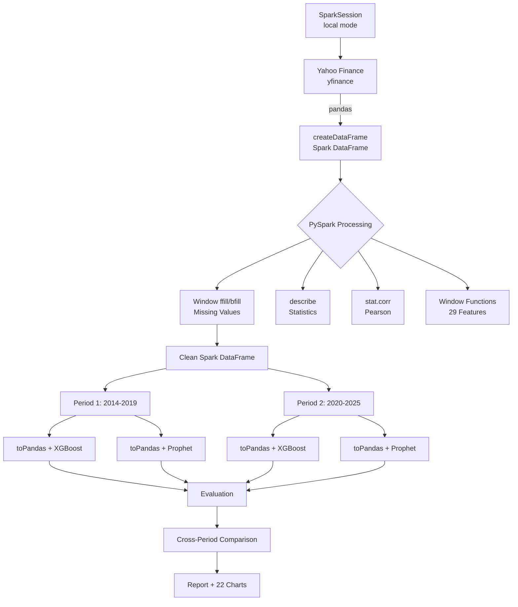

# 🚀 Dự án Antigravity (PySpark Edition)
## Phân tích Liên thị trường & Dự báo Giá Vàng

> **Phiên bản PySpark** — Sử dụng Apache Spark cho xử lý dữ liệu lớn.
> Phục vụ mục đích học thuật và nghiên cứu.

---

## 📋 Tổng quan dự án

Dự án phân tích mối quan hệ **liên thị trường** giữa 3 tài sản tài chính trong 2 giai đoạn lịch sử, sử dụng PySpark cho xử lý dữ liệu:

| Tài sản | Ticker | Mô tả |
|---------|--------|-------|
| 🥇 **Vàng (Gold)** | `GC=F` | Hợp đồng tương lai Vàng (USD/oz) |
| 🛢️ **Dầu thô WTI** | `CL=F` | Hợp đồng tương lai Dầu thô (USD/bbl) |
| 💵 **Chỉ số USD (DXY)** | `DX-Y.NYB` | Sức mạnh đồng USD so với rổ 6 ngoại tệ |

**Hai giai đoạn phân tích:**
- **2014-2019 (Pre-COVID):** 1,506 phiên giao dịch — Thị trường ổn định
- **2020-2025 (Post-COVID):** 1,508 phiên giao dịch — Thị trường biến động cao

---

## ⚡ PySpark trong dự án

| Module | PySpark API | Chi tiết |
|--------|-------------|----------|
| **Data Processing** | `SparkSession`, `createDataFrame` | Chuyển đổi pandas → Spark DataFrame |
| **Missing Values** | `F.last().over(Window)` | Forward-fill & backward-fill bằng Window functions |
| **Descriptive Stats** | `spark_df.describe()` | Thống kê mô tả (count, mean, std, min, max) |
| **Pearson Correlation** | `spark_df.stat.corr(a, b)` | Tính hệ số tương quan trực tiếp trên Spark |
| **Feature Engineering** | `F.lag()`, `F.avg()`, `F.stddev()`, `F.min()`, `F.max()` | Tạo 29 features bằng Window functions |
| **Date Features** | `F.dayofweek()`, `F.month()`, `F.quarter()` | Trích xuất đặc trưng thời gian |
| **Computed Columns** | `F.col("Gold") / F.col("WTI")` | Tính toán tỷ lệ giữa các tài sản |

---

## 📁 Cấu trúc dự án

```
antigravity_spark/
├── main.py                  # Pipeline chính (2 giai đoạn + so sánh)
├── spark_session.py         # SparkSession management + HADOOP_HOME
├── data_collection.py       # Thu thập & xử lý dữ liệu (PySpark)
├── correlation_analysis.py  # Tương quan (PySpark stat.corr)
├── model_xgboost.py         # XGBoost (PySpark feature engineering)
├── model_prophet.py         # Prophet + Regressors ngoại sinh
├── evaluation.py            # Đánh giá & so sánh mô hình
├── visualizations.py        # Tạo biểu đồ
├── period_comparison.py     # So sánh liên giai đoạn
├── requirements.txt
├── data/
│   ├── merged_data.csv
│   ├── prophet_data.csv
│   └── spark_schema.txt
└── output/
    ├── report.txt
    ├── xgboost_best_params.json
    └── figures/              # 22 biểu đồ phân tích
```

---

## ⚙️ Cài đặt & Chạy

### Yêu cầu hệ thống

- **Python 3.10+**
- **Java 17** (bắt buộc cho PySpark)
- **Hadoop winutils** (chỉ trên Windows)

### Cài đặt

```bash
# 1. Cài Java 17 (Windows)
winget install Microsoft.OpenJDK.17

# 2. Cài thư viện Python
pip install -r requirements.txt

# 3. Chạy pipeline (Windows PowerShell)
$env:JAVA_HOME='C:\Program Files\Microsoft\jdk-17.0.18.8-hotspot'
$env:PATH="$env:JAVA_HOME\bin;$env:PATH"
$env:PYTHONIOENCODING='utf-8'
python main.py
```

---

# 📊 KẾT QUẢ PHÂN TÍCH CHI TIẾT

---

## PHẦN I: PHÂN TÍCH TƯƠNG QUAN

### 1.1. Tương quan Pearson (tính bằng PySpark `stat.corr`)

#### Giai đoạn 2014-2019 (Pre-COVID)

|       | Gold     | WTI      | DXY      |
|-------|----------|----------|----------|
| **Gold**  | 1.0000   | **+0.1976**  | **−0.1123**  |
| **WTI**   | +0.1976  | 1.0000   | **−0.8520**  |
| **DXY**   | −0.1123  | −0.8520  | 1.0000   |


**Phân tích giai đoạn 2014-2019:**

- **Gold ↔ WTI (+0.198):** Tương quan dương yếu. Vàng và Dầu thô có xu hướng cùng chiều nhẹ — phù hợp với lý thuyết "lạm phát kỳ vọng" (cả hai đều là hàng hóa thực, phản ứng tương tự với lạm phát).

- **Gold ↔ DXY (−0.112):** Tương quan âm yếu. Đúng với lý thuyết kinh tế truyền thống: khi USD mạnh lên (DXY tăng), giá Vàng tính bằng USD có xu hướng giảm vì Vàng trở nên đắt hơn với người mua nắm giữ ngoại tệ khác.

- **WTI ↔ DXY (−0.852):** **Tương quan âm rất mạnh**. Đây là phát hiện quan trọng nhất — Dầu thô và USD di chuyển ngược chiều gần như hoàn hảo. Lý giải: Dầu thô được định giá bằng USD, khi USD mạnh lên, giá Dầu tính bằng USD giảm (và ngược lại). Đây là mối quan hệ cấu trúc kinh điển trong giai đoạn thị trường ổn định.

---

#### Giai đoạn 2020-2025 (Post-COVID)

|       | Gold     | WTI      | DXY      |
|-------|----------|----------|----------|
| **Gold**  | 1.0000   | **−0.0728**  | **+0.1014**  |
| **WTI**   | −0.0728  | 1.0000   | **+0.4654**  |
| **DXY**   | +0.1014  | +0.4654  | 1.0000   |


**Phân tích giai đoạn 2020-2025:**

- **Gold ↔ WTI (−0.073):** Gần như **không tương quan**. Vàng và Dầu đã "tách rời" hoàn toàn — Vàng được mua vì lý do trú ẩn an toàn (safe haven), trong khi Dầu bị ảnh hưởng bởi cung-cầu thực tế và chuyển dịch năng lượng xanh.

- **Gold ↔ DXY (+0.101):** **Đảo chiều** so với giai đoạn trước! Thay vì tương quan âm truyền thống, cả Vàng và USD đều được mua khi lo ngại về suy thoái kinh tế — cùng đóng vai trò "tài sản trú ẩn an toàn".

- **WTI ↔ DXY (+0.465):** **Đảo chiều hoàn toàn** từ −0.852 sang +0.465. Đây là sự thay đổi cấu trúc lớn nhất: sau đại dịch, lạm phát toàn cầu khiến cả Dầu và USD đều tăng đồng thời (FED tăng lãi suất → USD mạnh, đồng thời chuỗi cung ứng gián đoạn → Dầu tăng).

---

#### So sánh Pearson giữa 2 giai đoạn

| Cặp tài sản | 2014-2019 | 2020-2025 | Thay đổi | Ý nghĩa |
|-------------|-----------|-----------|----------|---------|
| Gold ↔ WTI | **+0.198** | **−0.073** | ↓ 0.270 | Tách rời hoàn toàn |
| Gold ↔ DXY | **−0.112** | **+0.101** | ↑ 0.214 | Đảo chiều (cùng safe haven) |
| WTI ↔ DXY | **−0.852** | **+0.465** | ↑ **1.317** | Đảo chiều cấu trúc |


> ⚠️ **Kết luận quan trọng:** Tất cả 3 cặp tương quan đã thay đổi đáng kể sau COVID-19, cho thấy cấu trúc thị trường tài chính toàn cầu đã chuyển sang trạng thái mới.

---

### 1.2. Rolling Correlation (Tương quan động)

Tương quan Pearson tĩnh chỉ cho thấy bức tranh trung bình — Rolling Correlation cho thấy mối quan hệ **thay đổi theo thời gian**.

#### 2014-2019


#### 2020-2025


**Nhận xét:**
- **2014-2019:** Gold ↔ DXY dao động quanh −0.3 đến +0.2, Gold ↔ WTI dao động quanh −0.2 đến +0.4. Tương đối ổn định.
- **2020-2025:** Biến động mạnh hơn nhiều, đặc biệt trong giai đoạn COVID-19 (đầu 2020) và cuộc xung đột Nga-Ukraine (2022), rolling correlation thay đổi rất nhanh giữa các cực.

---

### 1.3. Granger Causality (Kiểm tra nhân quả)

Granger Causality kiểm tra xem biến X có **dự báo được** biến Y hay không (không phải nhân quả thực sự, mà là khả năng dự đoán thống kê).

#### Giai đoạn 2014-2019

| Giả thuyết | Lag tốt nhất | p-value | Kết luận (α=0.05) |
|-----------|-------------|---------|-------------------|
| **DXY → Gold** | 3 | 0.0880 | ❌ KHÔNG có nhân quả Granger |
| **WTI → Gold** | 1 | 0.1159 | ❌ KHÔNG có nhân quả Granger |


#### Giai đoạn 2020-2025

| Giả thuyết | Lag tốt nhất | p-value | Kết luận (α=0.05) |
|-----------|-------------|---------|-------------------|
| **DXY → Gold** | 2 | 0.0774 | ❌ KHÔNG (nhưng gần ngưỡng) |
| **WTI → Gold** | 10 | 0.1520 | ❌ KHÔNG |


**Phân tích:**
- Trong cả 2 giai đoạn, **DXY gần đạt ngưỡng ý nghĩa** (p ~ 0.08), gợi ý rằng biến động USD có khả năng dự báo Vàng ở mức yếu nhưng chưa đủ mạnh để khẳng định thống kê.
- WTI không cho thấy khả năng dự báo Vàng đáng kể ở cả 2 giai đoạn trong phiên bản PySpark này.

---

## PHẦN II: DỰ BÁO GIÁ VÀNG

### 2.1. Phương pháp luận

#### XGBoost (Gradient Boosting)

| Thành phần | Chi tiết |
|-----------|---------|
| **Feature Engineering** | 29 features tạo bằng PySpark Window functions |
| **Lag features** | `F.lag("Gold", n)` với n = 1, 2, 3, 5, 7, 10, 14, 21 |
| **Rolling stats** | `F.avg/stddev/min/max("Gold").over(Window.rowsBetween(...))` cho cửa sổ 5, 10, 21 ngày |
| **Returns** | Lợi nhuận 1 ngày và 5 ngày |
| **Ratios** | Gold/WTI, Gold/DXY |
| **Date features** | `F.dayofweek()`, `F.month()`, `F.quarter()` |
| **Optimization** | Optuna Bayesian (50 trials, TimeSeriesSplit 3-fold CV) |
| **Train/Test** | 80/20 temporal split |

#### Prophet

| Thành phần | Chi tiết |
|-----------|---------|
| **Seasonality** | Weekly + Yearly (multiplicative) |
| **Regressors** | WTI (multiplicative), DXY (multiplicative) |
| **Changepoint** | `changepoint_prior_scale=0.05` |
| **Train/Test** | 80/20 temporal split |

---

### 2.2. Kết quả dự báo — Giai đoạn 2014-2019

#### Tham số tối ưu XGBoost (Optuna)

| Tham số | Giá trị |
|---------|---------|
| `n_estimators` | 512 |
| `max_depth` | 4 |
| `learning_rate` | 0.0456 |
| `subsample` | 0.755 |
| `colsample_bytree` | 0.671 |
| `min_child_weight` | 10 |
| `reg_alpha` | 0.205 |
| `reg_lambda` | 0.000585 |
| `gamma` | 0.00189 |

#### Bảng so sánh metrics

| Mô hình | MAE | RMSE | MAPE (%) | Nhận xét |
|---------|-----|------|----------|---------|
| **XGBoost (Train)** | 0.77 | 0.98 | 0.06% | Fit rất tốt (có dấu hiệu overfit nhẹ) |
| **XGBoost (Test)** | **53.02** | **81.70** | **3.58%** | ✅ **Tốt nhất** |
| Prophet (Train) | 143.95 | 181.24 | 11.41% | Fit trung bình |
| Prophet (Test) | 150.23 | 168.09 | 12.10% | Tương đối ổn định train/test |

> 🏆 **XGBoost thắng 3/3 chỉ số** trong giai đoạn 2014-2019.
> Sai số dự báo chỉ **3.58%** — rất phù hợp với thị trường ổn định.


#### Actual vs Predicted


**Phân tích:** XGBoost bám sát giá thực rất tốt, đặc biệt khi giá Vàng dao động trong khoảng $1,100–$1,550. Prophet có xu hướng dự báo trễ hơn khi giá biến động nhanh.

#### Top 10 Feature Importance (2014-2019)

| # | Feature | Importance | Loại |
|---|---------|-----------|------|
| 1 | `Gold_MA_5` | 0.3059 | Rolling Mean 5 ngày |
| 2 | `Gold_MAX_5` | 0.2313 | Rolling Max 5 ngày |
| 3 | `Gold_lag_1` | 0.2132 | Giá hôm trước |
| 4 | `Gold_MIN_5` | 0.1880 | Rolling Min 5 ngày |
| 5 | `Gold_MAX_10` | 0.0439 | Rolling Max 10 ngày |
| 6 | `Gold_return_1d` | 0.0044 | Lợi nhuận 1 ngày |
| 7 | `Gold_DXY_ratio` | 0.0040 | Tỷ lệ Gold/DXY |
| 8 | `Gold_return_5d` | 0.0038 | Lợi nhuận 5 ngày |
| 9 | `Gold_MIN_10` | 0.0013 | Rolling Min 10 ngày |
| 10 | `month` | 0.0006 | Tháng trong năm |


**Nhận xét:** Trong giai đoạn ổn định, XGBoost dựa vào **rolling stats ngắn hạn** (5 ngày) — cho thấy giá Vàng trong giai đoạn này có tính chất mean-reversion ngắn hạn.

#### Phân tích Residuals (2014-2019)


---

### 2.3. Kết quả dự báo — Giai đoạn 2020-2025

#### Giá Vàng 2020-2025


**Đặc điểm giai đoạn:** Giá Vàng tăng mạnh từ ~$1,500 lên ~$4,500, với nhiều cú sốc: COVID-19 (2020), lạm phát cao (2021-2022), xung đột Nga-Ukraine, FED tăng lãi suất, khủng hoảng ngân hàng (2023), và nhu cầu vàng từ BRICS (2024-2025).

#### Tham số tối ưu XGBoost (Optuna)

| Tham số | 2014-2019 | 2020-2025 | Thay đổi |
|---------|-----------|-----------|----------|
| `n_estimators` | 512 | **859** | ↑ Cần nhiều cây hơn |
| `max_depth` | 4 | **9** | ↑ Cần sâu hơn |
| `learning_rate` | 0.046 | **0.076** | ↑ Học nhanh hơn |
| `reg_alpha` | 0.205 | **1.945** | ↑ Regularization mạnh hơn |
| `gamma` | 0.002 | **0.483** | ↑ Pruning mạnh hơn |

> Giai đoạn biến động cần mô hình **phức tạp hơn** nhưng cũng cần **regularization mạnh hơn** để tránh overfit.

#### Bảng so sánh metrics

| Mô hình | MAE | RMSE | MAPE (%) | Nhận xét |
|---------|-----|------|----------|---------|
| **XGBoost (Train)** | 0.40 | 0.54 | 0.02% | Overfit nghiêm trọng |
| **XGBoost (Test)** | **629.45** | 810.03 | **17.07%** | ⚠️ MAE & MAPE tốt hơn |
| Prophet (Train) | 931.66 | 1175.24 | 40.74% | Fit kém |
| Prophet (Test) | 698.10 | **809.02** | 37.94% | RMSE tốt hơn nhẹ |

> 🤖 **XGBoost thắng 2/3 chỉ số** (MAE, MAPE) nhưng cả hai đều suy giảm so với 2014-2019.


#### Actual vs Predicted


**Phân tích:** Cả hai mô hình đều gặp khó khăn khi giá Vàng tăng mạnh trong 2024-2025. XGBoost bám sát hơn ở phần đầu test set nhưng lệch nhiều khi giá vượt ~$3,500. Prophet dự báo trễ và không bắt kịp xu hướng tăng mạnh.

#### Top 10 Feature Importance (2020-2025)

| # | Feature | Importance | So sánh với 2014-2019 |
|---|---------|-----------|----------------------|
| 1 | `Gold_MAX_21` | **0.6965** | ↑ Dominant (rolling 21 ngày thay vì 5 ngày) |
| 2 | `Gold_lag_1` | 0.0840 | ↓ Giảm tầm quan trọng |
| 3 | `Gold_lag_2` | 0.0631 | Mới top 3 |
| 4 | `Gold_MA_5` | 0.0387 | ↓ Từ #1 xuống #4 |
| 5 | `Gold_lag_3` | 0.0356 | Mới top 5 |
| 6 | `Gold_MAX_5` | 0.0280 | ↓ Từ #2 xuống #6 |
| 7 | `Gold_MA_21` | 0.0199 | Trung bình dài hạn hơn |
| 8 | `Gold_MIN_5` | 0.0111 | ↓ Giảm mạnh |
| 9 | `Gold_DXY_ratio` | 0.0084 | ↑ Tầm quan trọng tăng |
| 10 | `quarter` | 0.0024 | Quý trong năm (mùa vụ) |


**Nhận xét:** Trong giai đoạn biến động, `Gold_MAX_21` chiếm **69.65%** importance — mô hình phụ thuộc nặng vào đỉnh giá 21 ngày, phản ánh thị trường trending (momentum-driven) thay vì mean-reversion.

#### Phân tích Residuals (2020-2025)


#### Prophet Decomposition


**Nhận xét:** Prophet phân tách thành phần xu hướng (trend) tăng mạnh, chu kỳ tuần (weekly) và năm (yearly). Tuy nhiên, Prophet giả định xu hướng tuyến tính/logistic, không phù hợp khi xu hướng thay đổi đột ngột.

---

## PHẦN III: SO SÁNH LIÊN GIAI ĐOẠN

### 3.1. Sự thay đổi cấu trúc tương quan


| Cặp tài sản | 2014-2019 | 2020-2025 | Δ | Giải thích |
|-------------|-----------|-----------|---|-----------|
| Gold ↔ WTI | +0.198 | −0.073 | −0.270 | Vàng tách khỏi vai trò hàng hóa, chuyển sang safe haven thuần túy |
| Gold ↔ DXY | −0.112 | +0.101 | +0.214 | Cả Vàng và USD đều là kênh trú ẩn → cùng tăng khi bất ổn |
| **WTI ↔ DXY** | **−0.852** | **+0.465** | **+1.317** | **Đảo chiều cấu trúc:** lạm phát + cung ứng gián đoạn phá vỡ mối quan hệ truyền thống |

### 3.2. Suy giảm hiệu suất dự báo


| Mô hình | Chỉ số | 2014-2019 | 2020-2025 | % Suy giảm |
|---------|--------|-----------|-----------|------------|
| XGBoost | MAE | 53.02 | 629.45 | **+1,087%** |
| XGBoost | RMSE | 81.70 | 810.03 | **+891%** |
| XGBoost | MAPE | 3.58% | 17.07% | **+377%** |
| Prophet | MAE | 150.23 | 698.10 | **+365%** |
| Prophet | RMSE | 168.09 | 809.02 | **+381%** |
| Prophet | MAPE | 12.10% | 37.94% | **+213%** |

**Giải thích suy giảm:**
1. **Biên độ giá khác nhau:** Vàng 2014-2019 dao động $1,100–$1,550 (range ~$450), trong khi 2020-2025 dao động $1,477–$4,529 (range ~$3,052) — biên độ gấp **6.8 lần**.
2. **Xu hướng tăng mạnh:** Giá Vàng 2020-2025 tăng gần **3x**, các mô hình dựa trên dữ liệu quá khứ khó bắt kịp các breakout liên tục.
3. **Sự kiện bất thường:** COVID, chiến tranh, FED tăng lãi suất, de-dollarization — các black swan events không có trong dữ liệu huấn luyện.

### 3.3. So sánh giá Vàng


| Thống kê | 2014-2019 | 2020-2025 | Thay đổi |
|----------|-----------|-----------|----------|
| **Mean** | ~$1,260 | ~$2,190 | +74% |
| **Std** | ~$80 | ~$641 | +701% |
| **Min** | ~$1,060 | ~$1,477 | +39% |
| **Max** | ~$1,550 | ~$4,529 | +192% |

---

## PHẦN IV: KẾT LUẬN

### Về phân tích tương quan
1. **Mối quan hệ liên thị trường không bất biến** — tất cả 3 cặp tương quan đã thay đổi đáng kể sau COVID-19.
2. **WTI ↔ DXY đảo chiều hoàn toàn** (−0.852 → +0.465) — đây là bằng chứng mạnh về sự thay đổi cấu trúc thị trường.
3. **Vàng ngày càng đóng vai trò safe haven độc lập**, tách rời khỏi cả Dầu thô và USD.

### Về dự báo
1. **XGBoost vượt trội trong thị trường ổn định** (MAPE 3.58% vs 12.10%).
2. **Cả hai mô hình đều suy giảm mạnh** khi thị trường biến động — cần kết hợp thêm sentiment data, macro indicators.
3. **Feature engineering bằng PySpark** tạo được 29 features chất lượng, trong đó rolling statistics là nhóm quan trọng nhất.

### Về PySpark
1. PySpark cho phép **xử lý dữ liệu song song** và dễ mở rộng khi dataset lớn hơn.
2. **Window functions** rất phù hợp cho feature engineering chuỗi thời gian.
3. `stat.corr()` tính Pearson correlation natively trên Spark, tránh chuyển đổi sang pandas.

---

## 🛠️ Tech Stack

| Thư viện | Phiên bản | Mục đích |
|----------|-----------|----------|
| `pyspark` | ≥3.5 | **Data processing, feature engineering, correlation** |
| `yfinance` | ≥0.2 | Thu thập dữ liệu |
| `pandas` | ≥2.0 | Model training interface |
| `numpy` | ≥1.24 | Numerical computing |
| `xgboost` | ≥2.0 | Gradient Boosting ML |
| `optuna` | ≥3.4 | Bayesian Optimization |
| `prophet` | ≥1.1 | Time series forecasting |
| `matplotlib`, `seaborn` | — | Visualization |
| `statsmodels` | ≥0.14 | Granger Causality |

---

## 📄 Quy trình phân tích (PySpark Edition)



---

*Dự án Antigravity (PySpark Edition) — Phục vụ mục đích học thuật và nghiên cứu.*
