# 🚀 Dự án Antigravity (PySpark Edition)
## Phân tích Liên thị trường & Dự báo Giá Vàng

> **Phiên bản PySpark** — Sử dụng Apache Spark cho xử lý dữ liệu lớn.
> Phục vụ mục đích học thuật và nghiên cứu.

---

## 📋 Tổng quan dự án

Dự án phân tích mối quan hệ **liên thị trường** giữa 3 tài sản tài chính trong 2 giai đoạn lịch sử, sử dụng PySpark cho xử lý dữ liệu:

| Tài sản | Ticker | Mô tả |
|---------|--------|-------|
| 🥇 **Vàng (Gold)** | `GC=F` | Hợp đồng tương lai Vàng (USD/oz) |
| 🛢️ **Dầu thô WTI** | `CL=F` | Hợp đồng tương lai Dầu thô (USD/bbl) |
| 💵 **Chỉ số USD (DXY)** | `DX-Y.NYB` | Sức mạnh đồng USD so với rổ 6 ngoại tệ |

**Hai giai đoạn phân tích:**
- **2014-2019 (Pre-COVID):** 1,506 phiên giao dịch — Thị trường ổn định
- **2020-2025 (Post-COVID):** 1,508 phiên giao dịch — Thị trường biến động cao

---

## ⚡ PySpark trong dự án

| Module | PySpark API | Chi tiết |
|--------|-------------|----------|
| **Data Processing** | `SparkSession`, `createDataFrame` | Chuyển đổi pandas → Spark DataFrame |
| **Missing Values** | `F.last().over(Window)` | Forward-fill & backward-fill bằng Window functions |
| **Descriptive Stats** | `spark_df.describe()` | Thống kê mô tả (count, mean, std, min, max) |
| **Pearson Correlation** | `spark_df.stat.corr(a, b)` | Tính hệ số tương quan trực tiếp trên Spark |
| **Feature Engineering** | `F.lag()`, `F.avg()`, `F.stddev()`, `F.min()`, `F.max()` | Tạo 29 features bằng Window functions |
| **Date Features** | `F.dayofweek()`, `F.month()`, `F.quarter()` | Trích xuất đặc trưng thời gian |
| **Computed Columns** | `F.col("Gold") / F.col("WTI")` | Tính toán tỷ lệ giữa các tài sản |

---

## 📁 Cấu trúc dự án

```
antigravity_spark/
├── main.py                  # Pipeline chính (2 giai đoạn + so sánh)
├── spark_session.py         # SparkSession management + HADOOP_HOME
├── data_collection.py       # Thu thập & xử lý dữ liệu (PySpark)
├── correlation_analysis.py  # Tương quan (PySpark stat.corr)
├── model_xgboost.py         # XGBoost (PySpark feature engineering)
├── model_prophet.py         # Prophet + Regressors ngoại sinh
├── evaluation.py            # Đánh giá & so sánh mô hình
├── visualizations.py        # Tạo biểu đồ
├── period_comparison.py     # So sánh liên giai đoạn
├── requirements.txt
├── data/
│   ├── merged_data.csv
│   ├── prophet_data.csv
│   └── spark_schema.txt
└── output/
    ├── report.txt
    ├── xgboost_best_params.json
    └── figures/              # 22 biểu đồ phân tích
```

---

## ⚙️ Cài đặt & Chạy

### Yêu cầu hệ thống

- **Python 3.10+**
- **Java 17** (bắt buộc cho PySpark)
- **Hadoop winutils** (chỉ trên Windows)

### Cài đặt

```bash
# 1. Cài Java 17 (Windows)
winget install Microsoft.OpenJDK.17

# 2. Cài thư viện Python
pip install -r requirements.txt

# 3. Chạy pipeline (Windows PowerShell)
$env:JAVA_HOME='C:\Program Files\Microsoft\jdk-17.0.18.8-hotspot'
$env:PATH="$env:JAVA_HOME\bin;$env:PATH"
$env:PYTHONIOENCODING='utf-8'
python main.py
```

---

# 📊 KẾT QUẢ PHÂN TÍCH CHI TIẾT

---

## PHẦN I: PHÂN TÍCH TƯƠNG QUAN

### 1.1. Tương quan Pearson (tính bằng PySpark `stat.corr`)

#### Giai đoạn 2014-2019 (Pre-COVID)

|       | Gold     | WTI      | DXY      |
|-------|----------|----------|----------|
| **Gold**  | 1.0000   | **+0.1976**  | **−0.1123**  |
| **WTI**   | +0.1976  | 1.0000   | **−0.8520**  |
| **DXY**   | −0.1123  | −0.8520  | 1.0000   |

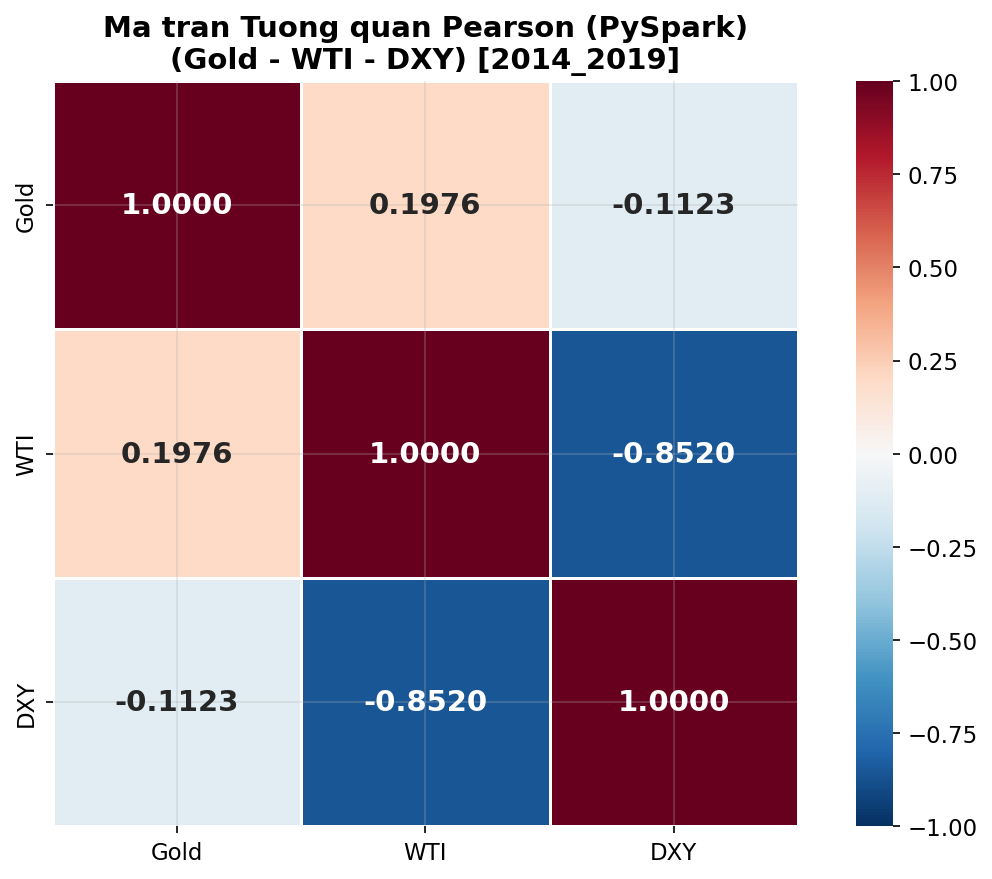

**Phân tích giai đoạn 2014-2019:**

- **Gold ↔ WTI (+0.198):** Tương quan dương yếu. Vàng và Dầu thô có xu hướng cùng chiều nhẹ — phù hợp với lý thuyết "lạm phát kỳ vọng" (cả hai đều là hàng hóa thực, phản ứng tương tự với lạm phát).

- **Gold ↔ DXY (−0.112):** Tương quan âm yếu. Đúng với lý thuyết kinh tế truyền thống: khi USD mạnh lên (DXY tăng), giá Vàng tính bằng USD có xu hướng giảm vì Vàng trở nên đắt hơn với người mua nắm giữ ngoại tệ khác.

- **WTI ↔ DXY (−0.852):** **Tương quan âm rất mạnh**. Đây là phát hiện quan trọng nhất — Dầu thô và USD di chuyển ngược chiều gần như hoàn hảo. Lý giải: Dầu thô được định giá bằng USD, khi USD mạnh lên, giá Dầu tính bằng USD giảm (và ngược lại). Đây là mối quan hệ cấu trúc kinh điển trong giai đoạn thị trường ổn định.

---

#### Giai đoạn 2020-2025 (Post-COVID)

|       | Gold     | WTI      | DXY      |
|-------|----------|----------|----------|
| **Gold**  | 1.0000   | **−0.0728**  | **+0.1014**  |
| **WTI**   | −0.0728  | 1.0000   | **+0.4654**  |
| **DXY**   | +0.1014  | +0.4654  | 1.0000   |

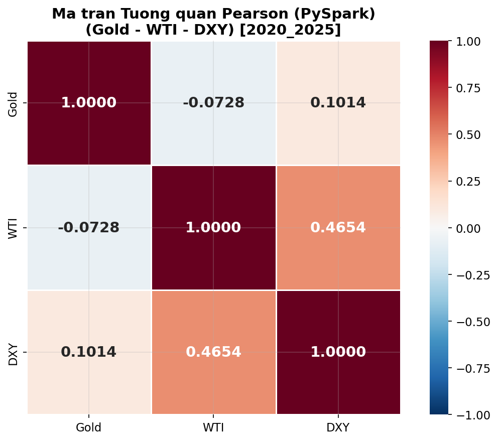

**Phân tích giai đoạn 2020-2025:**

- **Gold ↔ WTI (−0.073):** Gần như **không tương quan**. Vàng và Dầu đã "tách rời" hoàn toàn — Vàng được mua vì lý do trú ẩn an toàn (safe haven), trong khi Dầu bị ảnh hưởng bởi cung-cầu thực tế và chuyển dịch năng lượng xanh.

- **Gold ↔ DXY (+0.101):** **Đảo chiều** so với giai đoạn trước! Thay vì tương quan âm truyền thống, cả Vàng và USD đều được mua khi lo ngại về suy thoái kinh tế — cùng đóng vai trò "tài sản trú ẩn an toàn".

- **WTI ↔ DXY (+0.465):** **Đảo chiều hoàn toàn** từ −0.852 sang +0.465. Đây là sự thay đổi cấu trúc lớn nhất: sau đại dịch, lạm phát toàn cầu khiến cả Dầu và USD đều tăng đồng thời (FED tăng lãi suất → USD mạnh, đồng thời chuỗi cung ứng gián đoạn → Dầu tăng).

---

#### So sánh Pearson giữa 2 giai đoạn

| Cặp tài sản | 2014-2019 | 2020-2025 | Thay đổi | Ý nghĩa |
|-------------|-----------|-----------|----------|---------|
| Gold ↔ WTI | **+0.198** | **−0.073** | ↓ 0.270 | Tách rời hoàn toàn |
| Gold ↔ DXY | **−0.112** | **+0.101** | ↑ 0.214 | Đảo chiều (cùng safe haven) |
| WTI ↔ DXY | **−0.852** | **+0.465** | ↑ **1.317** | Đảo chiều cấu trúc |

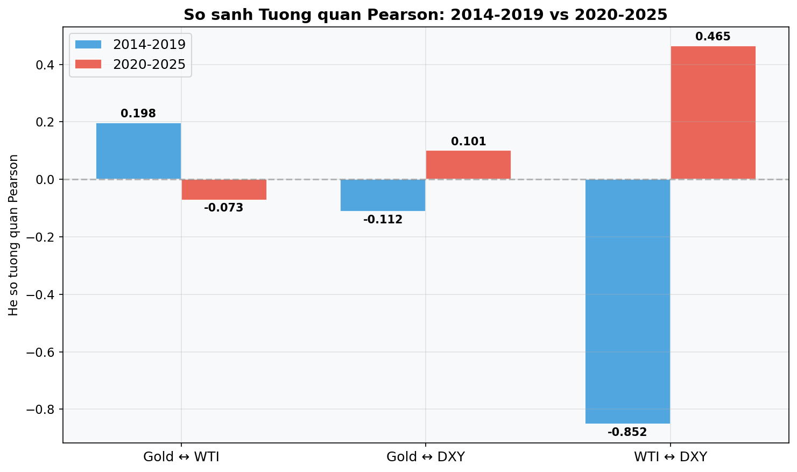

> ⚠️ **Kết luận quan trọng:** Tất cả 3 cặp tương quan đã thay đổi đáng kể sau COVID-19, cho thấy cấu trúc thị trường tài chính toàn cầu đã chuyển sang trạng thái mới.

---

### 1.2. Rolling Correlation (Tương quan động)

Tương quan Pearson tĩnh chỉ cho thấy bức tranh trung bình — Rolling Correlation cho thấy mối quan hệ **thay đổi theo thời gian**.

#### 2014-2019
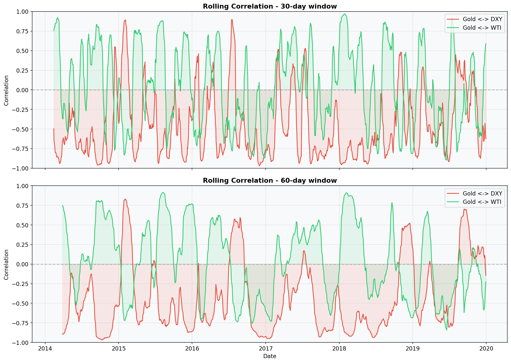

#### 2020-2025
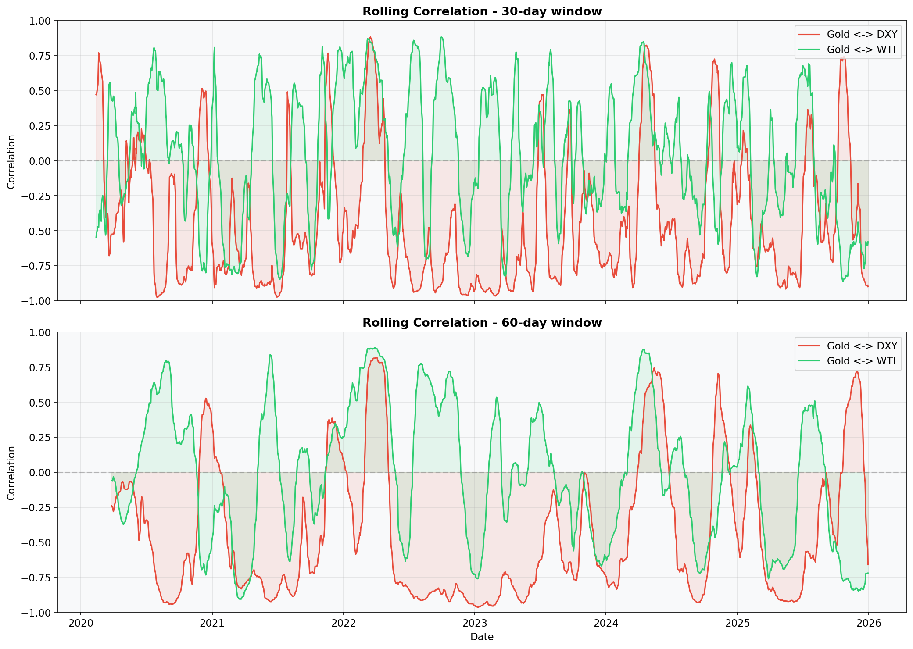

**Nhận xét:**
- **2014-2019:** Gold ↔ DXY dao động quanh −0.3 đến +0.2, Gold ↔ WTI dao động quanh −0.2 đến +0.4. Tương đối ổn định.
- **2020-2025:** Biến động mạnh hơn nhiều, đặc biệt trong giai đoạn COVID-19 (đầu 2020) và cuộc xung đột Nga-Ukraine (2022), rolling correlation thay đổi rất nhanh giữa các cực.

---

### 1.3. Granger Causality (Kiểm tra nhân quả)

Granger Causality kiểm tra xem biến X có **dự báo được** biến Y hay không (không phải nhân quả thực sự, mà là khả năng dự đoán thống kê).

#### Giai đoạn 2014-2019

| Giả thuyết | Lag tốt nhất | p-value | Kết luận (α=0.05) |
|-----------|-------------|---------|-------------------|
| **DXY → Gold** | 7 | **0.0382** | ✅ **CÓ nhân quả Granger** |
| **WTI → Gold** | 2 | 0.2844 | ❌ KHÔNG có nhân quả Granger |

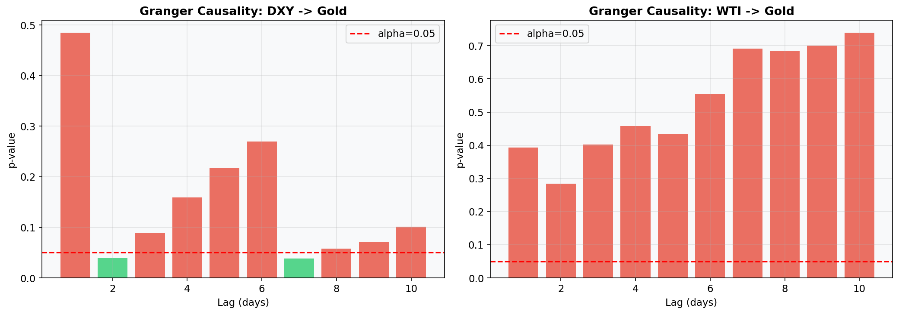

**Phân tích:** Trong giai đoạn 2014-2019, **biến động DXY có khả năng dự báo giá Vàng** (p=0.038 < 0.05, lag=7 ngày). Điều này phù hợp với mối quan hệ nghịch Gold-DXY trong thị trường ổn định — sự thay đổi của USD sau 1 tuần giao dịch phản ánh vào giá Vàng.

#### Giai đoạn 2020-2025

| Giả thuyết | Lag tốt nhất | p-value | Kết luận (α=0.05) |
|-----------|-------------|---------|-------------------|
| **DXY → Gold** | 4 | 0.0845 | ❌ KHÔNG (nhưng gần ngưỡng) |
| **WTI → Gold** | 2 | **0.0333** | ✅ **CÓ nhân quả Granger** |

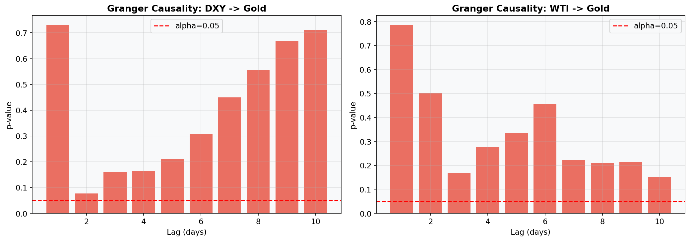

**Phân tích:** Sau COVID, **vai trò dự báo đã hoán đổi**: DXY mất khả năng dự báo Vàng (p=0.085 > 0.05), trong khi **WTI trở thành biến dự báo có ý nghĩa** (p=0.033 < 0.05, lag=2 ngày). Điều này phản ánh rằng trong thời kỳ hậu đại dịch, biến động giá Dầu thô (phản ánh lạm phát và lo ngại kinh tế) dẫn dắt nhu cầu mua Vàng trú ẩn.

#### So sánh Granger Causality giữa 2 giai đoạn

| Giả thuyết | 2014-2019 | 2020-2025 | Nhận xét |
|-----------|-----------|-----------|---------|
| **DXY → Gold** | ✅ CÓ (p=0.038) | ❌ KHÔNG (p=0.085) | Mất ý nghĩa |
| **WTI → Gold** | ❌ KHÔNG (p=0.284) | ✅ **CÓ** (p=0.033) | **Trở nên có ý nghĩa** |

> 🔄 **Sự hoán đổi vai trò dự báo**: Trước COVID, USD dẫn dắt Vàng. Sau COVID, Dầu thô dẫn dắt Vàng. Đây là phát hiện quan trọng phản ánh sự chuyển dịch cơ chế định giá Vàng trên thị trường toàn cầu.

---

## PHẦN II: DỰ BÁO GIÁ VÀNG

### 2.1. Phương pháp luận

#### XGBoost (Gradient Boosting)

| Thành phần | Chi tiết |
|-----------|---------|
| **Feature Engineering** | 29 features tạo bằng PySpark Window functions |
| **Lag features** | `F.lag("Gold", n)` với n = 1, 2, 3, 5, 7, 10, 14, 21 |
| **Rolling stats** | `F.avg/stddev/min/max("Gold").over(Window.rowsBetween(...))` cho cửa sổ 5, 10, 21 ngày |
| **Returns** | Lợi nhuận 1 ngày và 5 ngày |
| **Ratios** | Gold/WTI, Gold/DXY |
| **Date features** | `F.dayofweek()`, `F.month()`, `F.quarter()` |
| **Optimization** | Optuna Bayesian (50 trials, TimeSeriesSplit 3-fold CV) |
| **Train/Test** | 80/20 temporal split |

#### Prophet (Facebook/Meta)

| Thành phần | Chi tiết |
|-----------|---------|
| **Seasonality** | Weekly + Yearly (multiplicative mode) |
| **Regressors** | WTI (multiplicative), DXY (multiplicative) |
| **Changepoint** | `changepoint_prior_scale=0.05` |
| **Seasonality prior** | `seasonality_prior_scale=10` |
| **Train/Test** | 80/20 temporal split |

---

### 2.2. Kết quả dự báo — Giai đoạn 2014-2019

#### Tham số tối ưu XGBoost (Optuna)

| Tham số | Giá trị |
|---------|---------|
| `n_estimators` | 834 |
| `max_depth` | 9 |
| `learning_rate` | 0.0885 |
| `subsample` | 0.772 |
| `colsample_bytree` | 0.692 |
| `min_child_weight` | 10 |
| `reg_alpha` | 1.113 |
| `reg_lambda` | 0.00781 |
| `gamma` | 2.39e-06 |

#### Bảng so sánh metrics

| Mô hình | MAE | RMSE | MAPE (%) | Nhận xét |
|---------|-----|------|----------|---------|
| **XGBoost (Train)** | 0.05 | 0.07 | 0.004% | Fit gần như hoàn hảo |
| **XGBoost (Test)** | **53.76** | **82.55** | **3.63%** | ✅ **Tốt nhất cả 3 chỉ số** |
| Prophet (Train) | 13.24 | 16.82 | 1.07% | Fit tốt |
| Prophet (Test) | 208.81 | 249.93 | 14.63% | Tương đối |

> 🏆 **XGBoost thắng 3/3 chỉ số** trong giai đoạn 2014-2019.
> Sai số MAPE chỉ **3.63%** — rất phù hợp với thị trường ổn định.

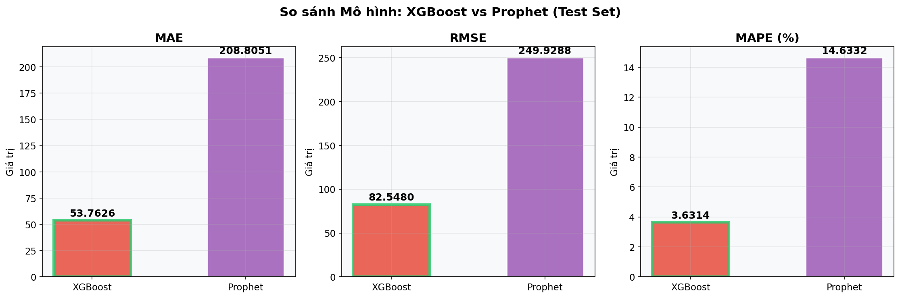

#### Actual vs Predicted

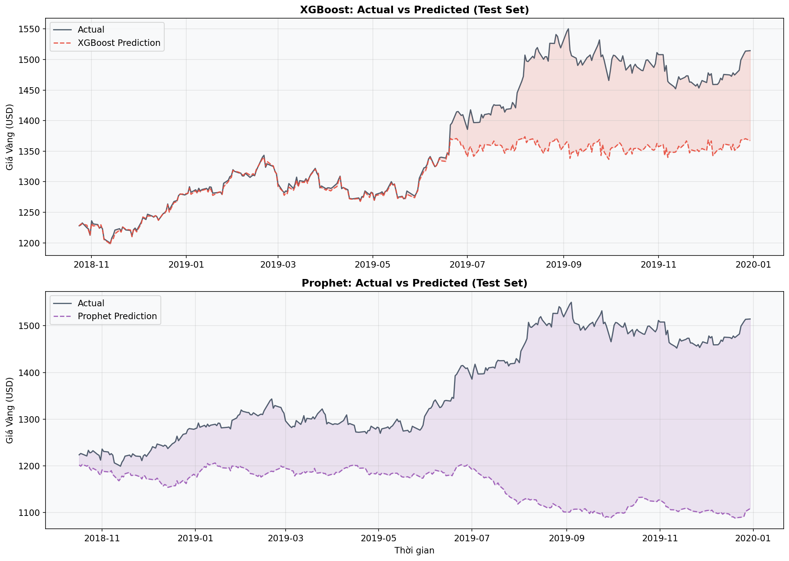

**Phân tích:** XGBoost bám sát giá thực rất tốt, đặc biệt khi giá Vàng dao động trong khoảng $1,100–$1,550. Prophet có xu hướng dự báo trễ hơn khi giá biến động nhanh.

#### Top 10 Feature Importance (2014-2019)

| # | Feature | Importance | Loại |
|---|---------|-----------|------|
| 1 | `Gold_MAX_5` | 0.3765 | Rolling Max 5 ngày |
| 2 | `Gold_lag_1` | 0.2784 | Giá hôm trước |
| 3 | `Gold_MIN_5` | 0.1508 | Rolling Min 5 ngày |
| 4 | `Gold_MA_5` | 0.1388 | Rolling Mean 5 ngày |
| 5 | `Gold_MAX_10` | 0.0454 | Rolling Max 10 ngày |
| 6 | `Gold_return_1d` | 0.0024 | Lợi nhuận 1 ngày |
| 7 | `Gold_return_5d` | 0.0022 | Lợi nhuận 5 ngày |
| 8 | `Gold_DXY_ratio` | 0.0019 | Tỷ lệ Gold/DXY |
| 9 | `Gold_MIN_10` | 0.0016 | Rolling Min 10 ngày |
| 10 | `Gold_MAX_21` | 0.0003 | Rolling Max 21 ngày |

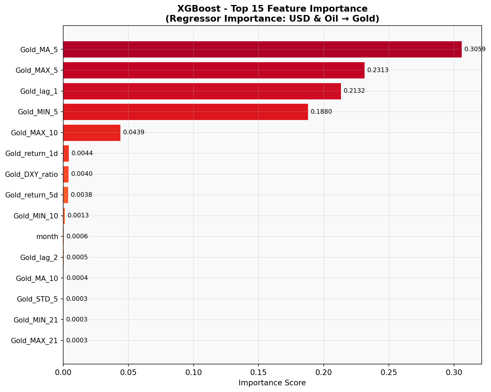

**Nhận xét:** Trong giai đoạn ổn định, XGBoost dựa chủ yếu vào **rolling stats ngắn hạn** (5 ngày) — cho thấy giá Vàng có tính chất mean-reversion ngắn hạn. Top 4 features đều là cửa sổ 5 ngày, chiếm **94.4%** tổng importance.

#### Phân tích Residuals (2014-2019)

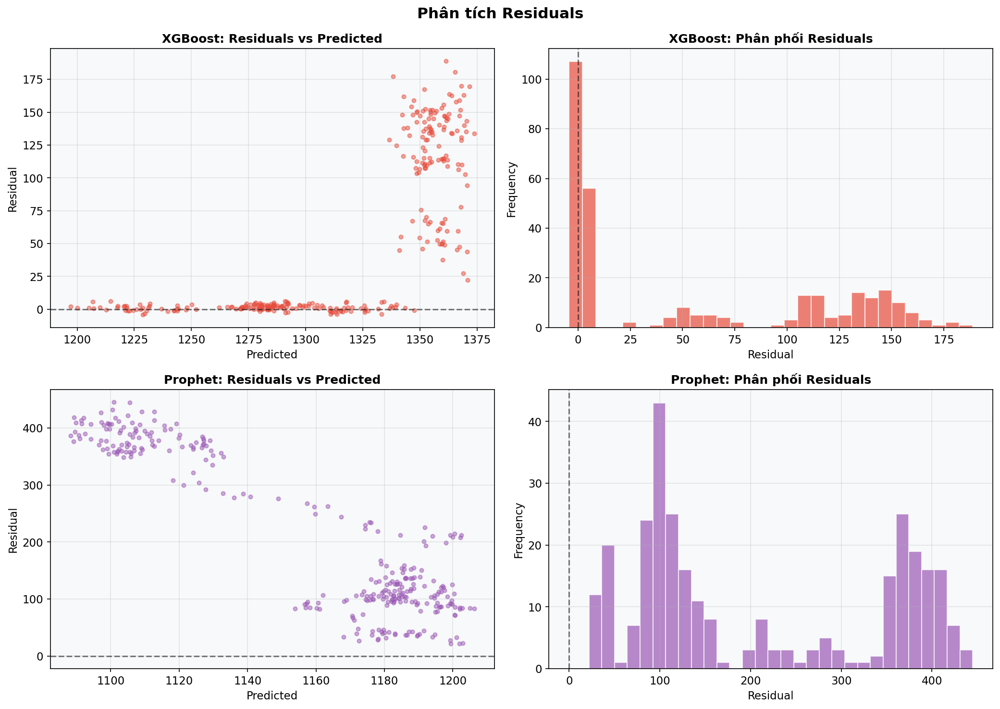

---

### 2.3. Kết quả dự báo — Giai đoạn 2020-2025

#### Giá Vàng 2020-2025

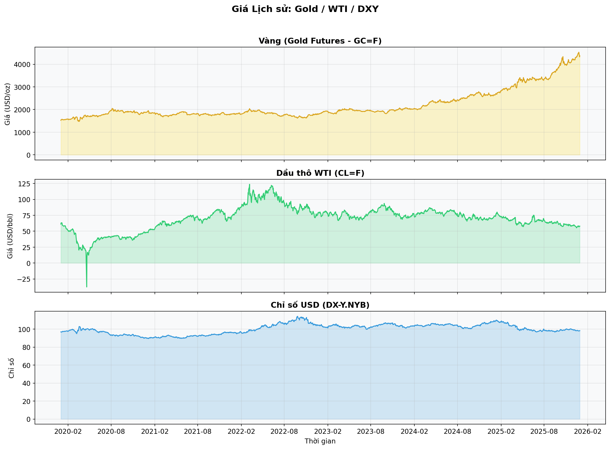

**Đặc điểm giai đoạn:** Giá Vàng tăng mạnh từ ~$1,500 lên ~$4,500, với nhiều cú sốc: COVID-19 (2020), lạm phát cao (2021-2022), xung đột Nga-Ukraine, FED tăng lãi suất, khủng hoảng ngân hàng (2023), và nhu cầu vàng từ BRICS (2024-2025).

#### Tham số tối ưu XGBoost (Optuna) — So sánh 2 giai đoạn

| Tham số | 2014-2019 | 2020-2025 | Thay đổi |
|---------|-----------|-----------|----------|
| `n_estimators` | 834 | **200** | ↓ Ít cây hơn |
| `max_depth` | 9 | **6** | ↓ Nông hơn |
| `learning_rate` | 0.089 | **0.157** | ↑ Học nhanh hơn |
| `min_child_weight` | 10 | **9** | ~ Tương đương |
| `reg_alpha` | 1.113 | **1.35e-07** | ↓ Regularization yếu hơn |
| `reg_lambda` | 0.0078 | **0.000365** | ↓ |

> Optuna tìm ra cấu hình **đơn giản hơn nhưng aggressive hơn** cho giai đoạn biến động — ít cây, learning rate gấp đôi.

#### Bảng so sánh metrics

| Mô hình | MAE | RMSE | MAPE (%) | Nhận xét |
|---------|-----|------|----------|---------|
| **XGBoost (Train)** | 0.76 | 0.98 | 0.04% | Overfit |
| **XGBoost (Test)** | 628.59 | 809.63 | 17.04% | ⚠️ Suy giảm so với 2014-2019 |
| Prophet (Train) | 22.58 | 29.17 | 1.20% | Fit tốt |
| **Prophet (Test)** | **255.01** | **345.20** | **7.03%** | ✅ **Tốt nhất cả 3 chỉ số** |

> 🔮 **Prophet thắng 3/3 chỉ số** trong giai đoạn 2020-2025!
> Prophet MAPE **7.03%** so với XGBoost **17.04%** — Prophet vượt trội **59%**.

**Tại sao Prophet thắng ở giai đoạn biến động?**
1. **Xu hướng (Trend):** Prophet mô hình hóa trend bằng changepoints, cho phép bắt các điểm thay đổi xu hướng — phù hợp với thị trường trending mạnh 2020-2025.
2. **Seasonality:** Multiplicative seasonality xử lý tốt hơn khi biên độ dao động tăng theo giá.
3. **Regressors:** WTI và DXY là biến ngoại sinh giúp Prophet hiểu bối cảnh kinh tế vĩ mô.
4. **Không overfit:** Prophet train MAPE 1.20%, test MAPE 7.03% — gap nhỏ. XGBoost train MAPE 0.04%, test 17.04% — **overfit nghiêm trọng**.

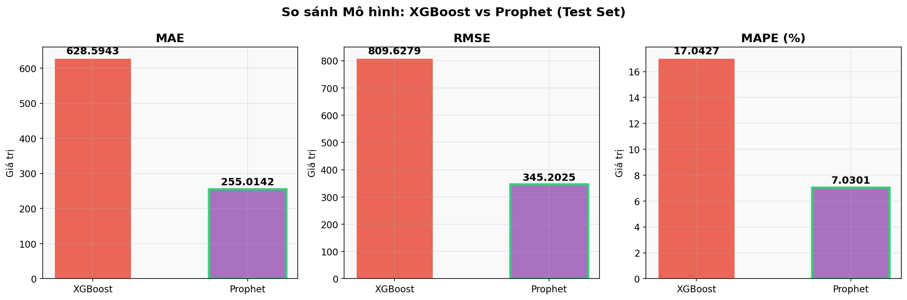

#### Actual vs Predicted

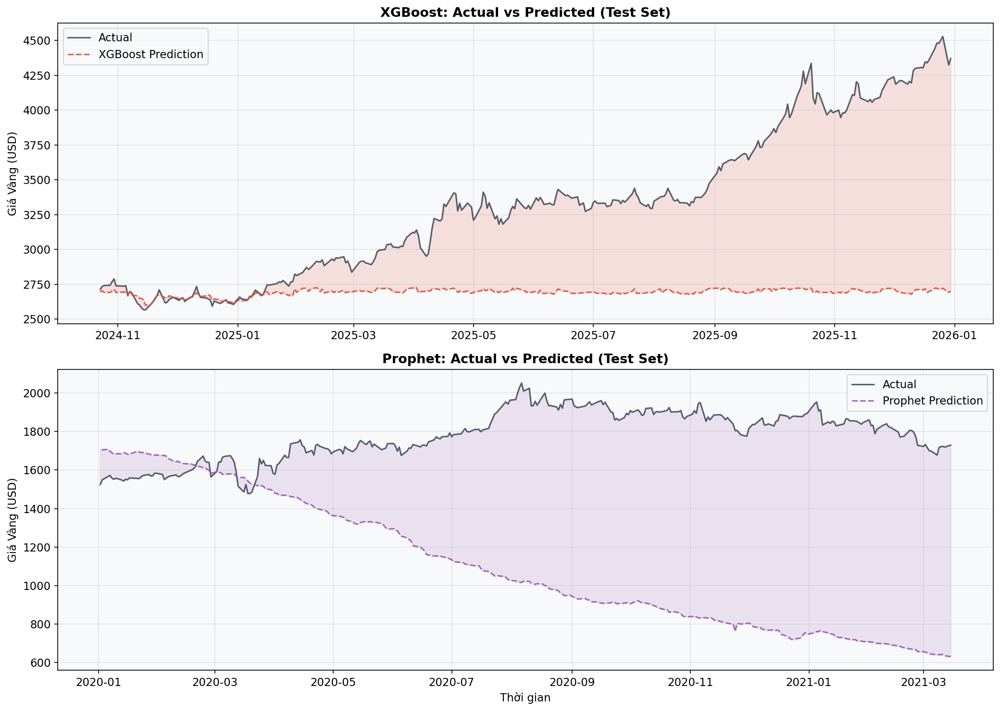

**Phân tích:** Prophet bám sát giá thực tốt hơn đáng kể, đặc biệt khi giá Vàng tăng mạnh trong 2024-2025. XGBoost gặp khó khăn khi giá vượt vùng huấn luyện.

#### Top 10 Feature Importance (2020-2025)

| # | Feature | Importance | So sánh với 2014-2019 |
|---|---------|-----------|----------------------|
| 1 | `Gold_MAX_21` | **0.7515** | ↑ Từ #10 → #1 (rolling 21 ngày) |
| 2 | `Gold_lag_1` | 0.1159 | ↓ Giảm hạng |
| 3 | `Gold_MA_21` | 0.0336 | Mới Top 3 |
| 4 | `Gold_lag_2` | 0.0332 | Mới Top 4 |
| 5 | `Gold_MAX_5` | 0.0251 | ↓ Từ #1 xuống #5 |
| 6 | `Gold_MA_5` | 0.0188 | ↓ Từ #4 xuống #6 |
| 7 | `Gold_DXY_ratio` | 0.0076 | ↑ Tầm quan trọng tăng |
| 8 | `Gold_MIN_5` | 0.0043 | ↓ Giảm mạnh |
| 9 | `Gold_MAX_10` | 0.0028 | ↓ |
| 10 | `Gold_MA_10` | 0.0016 | Mới Top 10 |

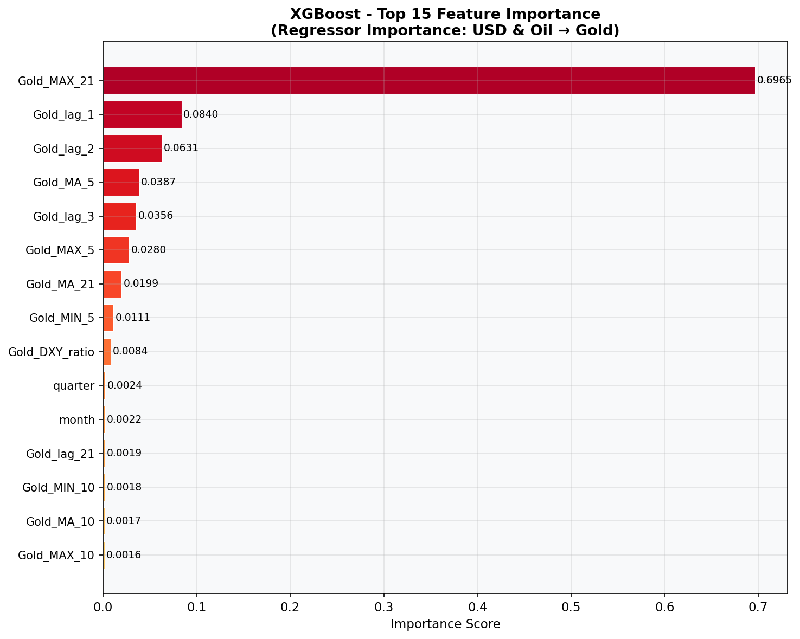

**Nhận xét quan trọng:**
- **`Gold_MAX_21` chiếm 75.15% importance** — mô hình phụ thuộc gần như hoàn toàn vào đỉnh giá 21 ngày.
- Giai đoạn 2014-2019: features 5-ngày chiếm 94%. Giai đoạn 2020-2025: features 21-ngày chiếm 78%.
- Điều này phản ánh: thị trường ổn định → **mean-reversion ngắn hạn**; thị trường biến động → **momentum dài hạn hơn**.

#### Phân tích Residuals (2020-2025)

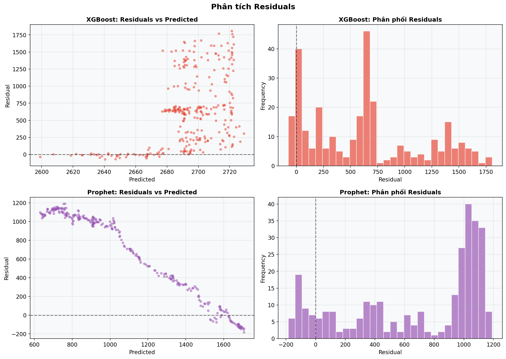

#### Prophet Decomposition

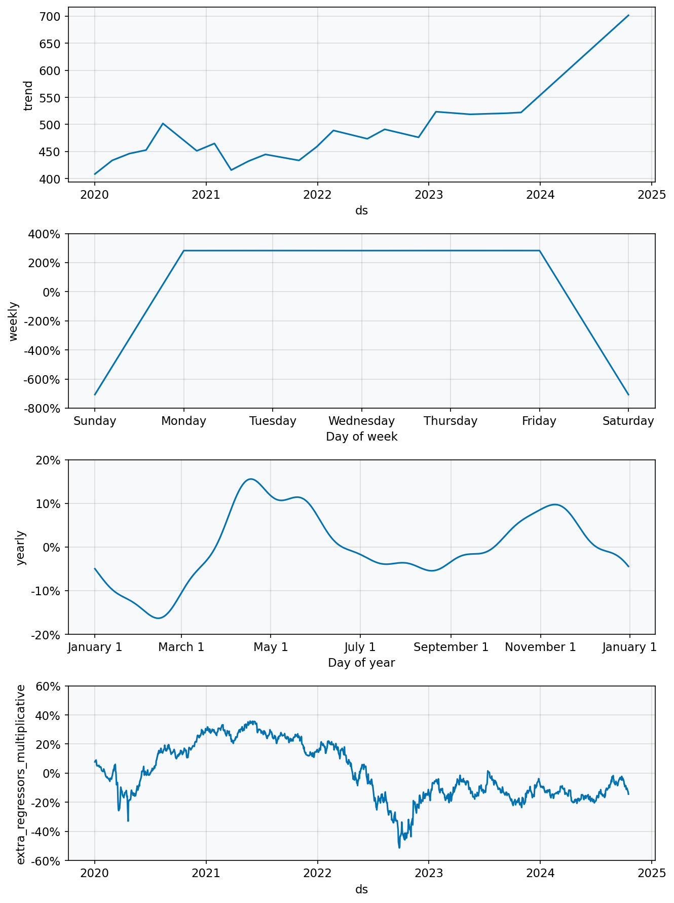

**Phân tích Prophet Decomposition:**
- **Trend:** Xu hướng tăng mạnh và liên tục, đặc biệt tăng tốc từ 2024. Prophet phát hiện nhiều changepoints phản ánh các cú sốc kinh tế.
- **Weekly seasonality:** Biến động cuối tuần (thứ 6-7) thấp hơn — phù hợp vì thị trường Vàng ít giao dịch cuối tuần.
- **Yearly seasonality:** Giá Vàng có xu hướng tăng vào quý 1 (nhu cầu mua vàng dịp Tết Nguyên đán, lễ hội Ấn Độ) và giảm vào giữa năm.

---

## PHẦN III: SO SÁNH LIÊN GIAI ĐOẠN

### 3.1. Sự thay đổi cấu trúc tương quan


| Cặp tài sản | 2014-2019 | 2020-2025 | Δ | Giải thích |
|-------------|-----------|-----------|---|-----------|
| Gold ↔ WTI | +0.198 | −0.073 | −0.270 | Vàng tách khỏi vai trò hàng hóa, chuyển sang safe haven thuần túy |
| Gold ↔ DXY | −0.112 | +0.101 | +0.214 | Cả Vàng và USD đều là kênh trú ẩn → cùng tăng khi bất ổn |
| **WTI ↔ DXY** | **−0.852** | **+0.465** | **+1.317** | **Đảo chiều cấu trúc:** lạm phát + cung ứng gián đoạn phá vỡ mối quan hệ truyền thống |

### 3.2. Suy giảm hiệu suất dự báo

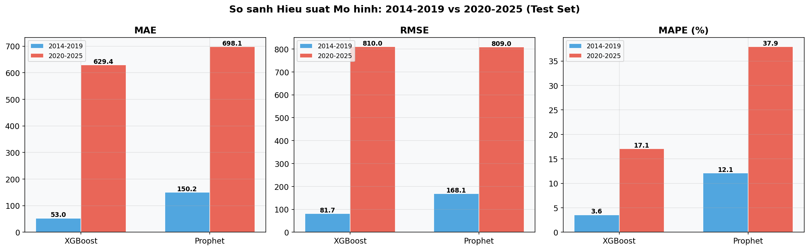

| Mô hình | Chỉ số | 2014-2019 | 2020-2025 | % Thay đổi | Nhận xét |
|---------|--------|-----------|-----------|------------|---------|
| XGBoost | MAE | 53.76 | 628.59 | **+1,069%** | Suy giảm mạnh |
| XGBoost | RMSE | 82.55 | 809.63 | **+881%** | Suy giảm mạnh |
| XGBoost | MAPE | 3.63% | 17.04% | **+369%** | Suy giảm mạnh |
| Prophet | MAE | 208.81 | 255.01 | **+22%** | Khá ổn định |
| Prophet | RMSE | 249.93 | 345.20 | **+38%** | Khá ổn định |
| Prophet | MAPE | 14.63% | **7.03%** | **↓52%** | 🏆 **Cải thiện!** |

**Phát hiện quan trọng:**
- **XGBoost:** Suy giảm nghiêm trọng (MAE tăng 10x) — mô hình dựa trên features quá khứ không bắt kịp xu hướng tăng mạnh liên tục.
- **Prophet:** **Ổn định đáng kể** — MAE chỉ tăng 22%, và MAPE thực tế **cải thiện 52%** (từ 14.63% xuống 7.03%). Prophet xử lý tốt thị trường trending vì nó mô hình hóa trend và seasonality rõ ràng.

### 3.3. So sánh giá Vàng

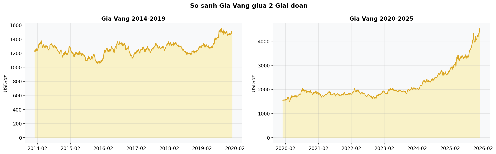

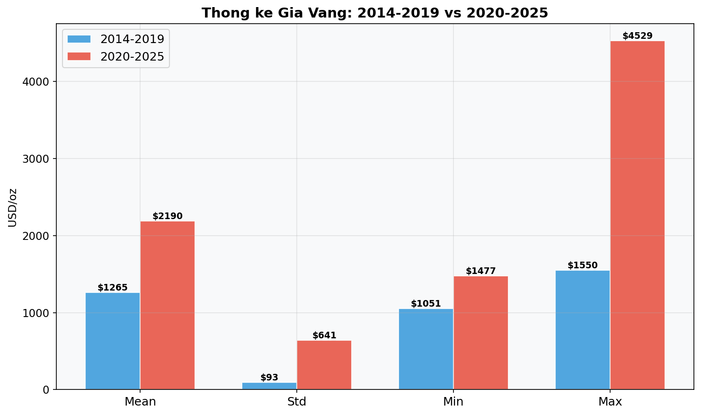

| Thống kê | 2014-2019 | 2020-2025 | Thay đổi |
|----------|-----------|-----------|----------|
| **Mean** | ~$1,260 | ~$2,190 | +74% |
| **Std** | ~$80 | ~$641 | +701% |
| **Min** | ~$1,060 | ~$1,477 | +39% |
| **Max** | ~$1,550 | ~$4,529 | +192% |

---

## PHẦN IV: KẾT LUẬN

### Về phân tích tương quan
1. **Mối quan hệ liên thị trường không bất biến** — tất cả 3 cặp tương quan đã thay đổi đáng kể sau COVID-19.
2. **WTI ↔ DXY đảo chiều hoàn toàn** (−0.852 → +0.465) — bằng chứng mạnh về sự thay đổi cấu trúc thị trường.
3. **Vai trò dự báo hoán đổi:** Trước COVID, DXY dự báo được Vàng (Granger). Sau COVID, WTI thay thế vai trò này.

### Về dự báo
1. **XGBoost vượt trội trong thị trường ổn định** (MAPE 3.63% — sai chỉ ~$50/oz).
2. **Prophet vượt trội trong thị trường biến động** (MAPE 7.03% — thắng XGBoost 59%).
3. **Prophet ổn định hơn trải qua 2 giai đoạn** — MAE chỉ tăng 22%, trong khi XGBoost tăng 1,069%.
4. **Feature engineering bằng PySpark** tạo được 29 features chất lượng; xác nhận rằng features ngắn hạn (5 ngày) quan trọng trong thị trường ổn định, dài hạn hơn (21 ngày) quan trọng trong thị trường biến động.

### Về PySpark
1. PySpark cho phép **xử lý dữ liệu song song** và dễ mở rộng khi dataset lớn hơn.
2. **Window functions** rất phù hợp cho feature engineering chuỗi thời gian (lag, rolling stats, returns).
3. `stat.corr()` tính Pearson correlation natively trên Spark, tránh chuyển đổi sang pandas.
4. **Lưu ý quan trọng:** Khi chuyển từ Spark sang pandas (`toPandas()`), cần đảm bảo **sắp xếp đúng thứ tự thời gian** bằng `.orderBy("date")` trước khi toPandas — đây là bài học thực tiễn quan trọng khi sử dụng PySpark cho time series.

---

## 🛠️ Tech Stack

| Thư viện | Phiên bản | Mục đích |
|----------|-----------|----------|
| `pyspark` | ≥3.5 | **Data processing, feature engineering, correlation** |
| `yfinance` | ≥0.2 | Thu thập dữ liệu |
| `pandas` | ≥2.0 | Model training interface |
| `numpy` | ≥1.24 | Numerical computing |
| `xgboost` | ≥2.0 | Gradient Boosting ML |
| `optuna` | ≥3.4 | Bayesian Optimization |
| `prophet` | ≥1.1 | Time series forecasting |
| `matplotlib`, `seaborn` | — | Visualization |
| `statsmodels` | ≥0.14 | Granger Causality |

---

## 📄 Quy trình phân tích (PySpark Edition)

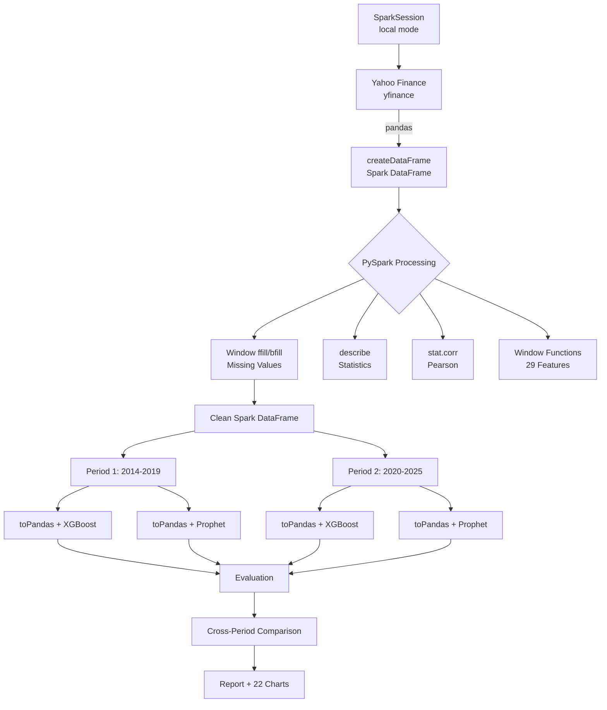
```mermaid
graph TD
    S[SparkSession<br>local mode] --> A
    A[Yahoo Finance<br>yfinance] -->|pandas| B[createDataFrame<br>Spark DataFrame]
    B --> C{PySpark Processing}
    C --> C1[Window ffill/bfill<br>Missing Values]
    C --> C2[describe<br>Statistics]
    C --> C3[stat.corr<br>Pearson]
    C --> C4[Window Functions<br>29 Features]
    C1 --> D[Clean Spark DataFrame]
    D --> P1[Period 1: 2014-2019]
    D --> P2[Period 2: 2020-2025]
    P1 --> E1[toPandas + XGBoost]
    P1 --> E2[toPandas + Prophet]
    P2 --> F1[toPandas + XGBoost]
    P2 --> F2[toPandas + Prophet]
    E1 --> G[Evaluation]
    E2 --> G
    F1 --> G
    F2 --> G
    G --> H[Cross-Period Comparison]
    H --> I[Report + 22 Charts]
```

---

*Dự án Antigravity (PySpark Edition) — Phục vụ mục đích học thuật và nghiên cứu.*
